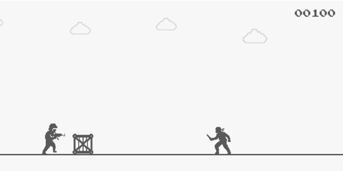
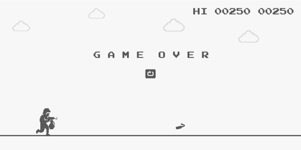

# Counter-Strike Run 🏃

A Counter-Strike-themed endless runner built in Python, inspired by Google Chrome’s Dino game and featuring custom pixel-art assets.

## Demo
### Gameplay Screen

### Game Over Screen


## Features
- 🎮 **Endless runner gameplay**  
  Jump over grounded obstacles, crouch under airborne obstacles, and survive as long as possible.
- 🎞️ **Animated player character**  
  The player has running, crouching, and jumping sprites.
- 🚧 **Grounded and airborne obstacles**  
  Grounded obstacles include crate, enemy, and chicken sprites. Airborne obstacles include grenade and molotov sprites.
- ↕️ **Airborne obstacle height levels**  
  Airborne obstacles can spawn low, mid, or high, requiring different jump or crouch reactions.
- ⚡ **Increasing game speed**  
  The game starts at a base speed and gradually accelerates until reaching a maximum speed cap.
- 🏆 **Score and high score tracking**  
  The current score and high score display in a retro arcade-style format.
- 🔔 **Milestone feedback**  
  Every 100 points plays a sound effect and flashes the score.

## Project Structure

- `main.py`
- `game.py`
- `player.py`
- `obstacle.py`
- `decoration.py`
- `settings.py`
- `requirements.txt`
- `assets/`
  - `player/`
  - `obstacles/`
  - `decorations/`
  - `sounds/`
  - `ui/`
  - `fonts/`

## Installation and Execution
### 1. Clone the Repository
```
git clone https://github.com/1linden/Counter-Strike_Run.git
```
### 2. Install Dependencies
```
pip install -r requirements.txt
```
### 3. Run the Game
```
python main.py
```

## How the Game Works

1. The player automatically runs from left to right as obstacles get closer to them.
2. Press `SPACE` or `UP` to jump and `DOWN` to crouch.
3. Avoid grounded obstacles by jumping over them.
4. Avoid airborne obstacles by jumping, crouching, or choosing the correct movement based on their height.
5. If the player collides with an obstacle, the game ends.
6. Restart with `SPACE`, `UP`, `R`, or the restart button.

## Technologies Used
- Python
- Pygame - rendering, input, audio, sprites, and collision masks

## License

This project is for educational purposes and is not affiliated with Valve, Counter-Strike, or the Google Chrome Dino game.
